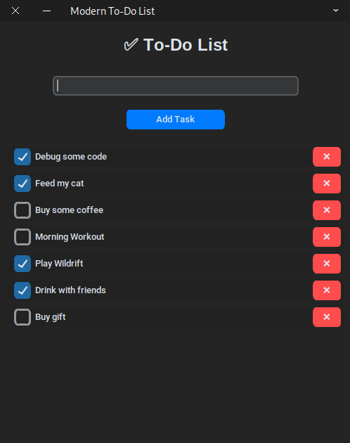

# ✅ To-Do List App  

A simple To-Do List app built with CustomTkinter and SQLite.  

## 📌 Features  
✔️ Add tasks  
✔️ Delete tasks  
✔️ Mark tasks as done  

## 🖼️ Preview  


## 🔧 Installation  
1. Clone the repository:  
   ```bash
   git clone https://github.com/veillemm10899/ToDo-List-App.git
   cd ToDo-List-App
>>>>>>> cc5214b (Finalizing To-Do List app upload)
